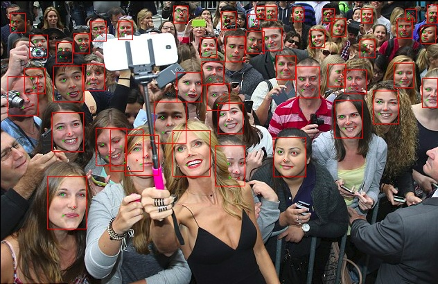

# RetinaFace-tf2
RetinaFace (RetinaFace: Single-stage Dense Face Localisation in the Wild, published in 2019) reimplemented in Tensorflow 2.0, with pretrained weights available. Resnet50 backbone.

Original paper -> [arXiv](https://arxiv.org/pdf/1905.00641.pdf)  
Original Mxnet implementation -> [Insightface](https://github.com/deepinsight/insightface/tree/master/RetinaFace)


### Table of contents
1. [ Installation ](#Installation)
2. [ Usage ](#Usage)
3. [ Benchmark ](#Benchmark)
4. [ Evaluation ](#Evaluation)
5. [ Acknowledgements ](#Acknowledgements)

example output : 



*****
<a name="Installation"></a>
## INSTALLATION
To install dependencies, run : 
```
pip install -r requirements.txt
```

Then build the rcnn module by running : 
```
make
```
<a name="Usage"></a>
## USAGE
Run  :
```angular2
python detect.py --sample_img="./sample-images/WC_FR.jpeg"
```
Python usage :
```python
from src.retinafacetf2.retinaface import RetinaFace
import cv2

detector = RetinaFace(False, 0.4)
img = cv2.imread("./sample-images/WC_FR.jpeg")
faces, landmarks = detector.detect(img, 0.9)
```
<a name="Benchmark"></a>
## BENCHMARK   
mAP result values on the WIDERFACE validation dataset:  

| Model  | Easy  | Medium  | Hard  |
|---|---|---|---|
|Original Mxnet implementation   | 96.5  | 95.6 | 90.4 |
| Ours | 95.6  | 94.6  | 88.5  |

<a name="Evaluation"></a>
## EVALUATE ON WIDERFACE
In order to verify the models accuracy on the WiderFace dataset:
* Run the model on the dataset and generate text files as results
```angular2
python eval_widerface --widerface_data_dir = "/data/WIDER_test/images" --save_folder="./WiderFace-Evaluation/results/"
```
* Evaluate the results
```angular2
cd ./WiderFace-Evaluation
python setup.py build_ext --inplace
python evaluation.py -p ./results_val/ -g ./ground_truth/
```

<a name="Acknowledgements"></a>
## ACKNOWLEDGEMENTS
This work is largely based on the original implementation by the amazing [insightface](https://github.com/deepinsight/insightface) team  
Evaluation on widerface done with the [Widerface-Evaluation](https://github.com/wondervictor/WiderFace-Evaluation) repo  
If you use this repo, please reference the original work :

```  
@inproceedings{Deng2020CVPR,
title = {RetinaFace: Single-Shot Multi-Level Face Localisation in the Wild},
author = {Deng, Jiankang and Guo, Jia and Ververas, Evangelos and Kotsia, Irene and Zafeiriou, Stefanos},
booktitle = {CVPR},
year = {2020}
}
```